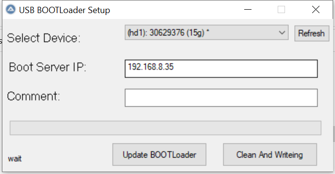

# vDisk USB Bootloader Setup · 启动 U 盘制作工具

## 本程序是做什么的（请先读这一段）


**USB BOOTLoader Setup**  vDisk云桌面的U盘启动工具，其中

**usb_rom_vDisk** 项目为 启动ROM制作工具，用于在第一次下发时，提供单台计算机启动支持。第一台计算机启动成功后，直接在ROM中开启 DHCP Proxy 其他计算机直接使用网络启动即可
**usb_pe**    项目为  PE恢复盘制作工具


## 以下内容为自动生成  仅供参考

### 主界面与控件

| 界面元素 | 作用 |
|----------|------|
| **窗口标题** | `USB BOOTLoader Setup` |
| **Select Device** | 下拉列表选择目标 U 盘。列表由 `fbinst --list` 与 **仅 USB 磁盘** 过滤生成，降低误选内置硬盘的风险。 |
| **Refresh** | 重新枚举 USB 设备并刷新下拉列表（插拔 U 盘后使用）。 |
| **Boot Server IP** | 制作时用于 **HTTP 下载** 的 Boot 服务器地址（默认示例 `192.168.8.35`）。程序会尝试从注册表预填上次使用过的服务器地址（键名以源码 `RegRead` / `RegWrite` 为准）。 |
| **Comment** | **启动参数**：会写入生成的 `bootloader.lst` 与 UEFI `grub.cfg`，追加到 **内核命令行**（与 vmlinuz 同行），用于向启动后的维护环境传递参数；请与现场规范或用户手册中的「启动参数」说明一致。 |
| **进度条** | 显示当前制作/更新阶段的大致进度。 |
| **底部状态文字** | 显示当前步骤提示（如格式化、下载、拷贝等）。 |

### 按钮：Clean And Writeing（全新制作）

对所选 U 盘执行 **完整重写**（会提示确认 **Clean disk and write to USB?**）：

1. 使用 **fbinst** 对 U 盘做 **raw 级重置** 与 **FAT32 UD** 等布局（含对齐与扩展分区参数）。
2. 使用 **PartAssist** 创建/格式化 **Data（NTFS）** 分区、调整空间，并建立 **EFI（FAT16）** 隐藏分区等（与脚本内命令一致）。
3. 通过内置 **wget** 从 `http://<Boot Server IP>:7012` 下载引导组件，例如：`corex64.gz`、`vmlinuzx64`，以及 U 盘可见分区下 `BOOT\disk.zip`、`BOOT\diskgpt.zip` 等（失败会弹窗并提示查看日志）。
4. 将内置 **pe.fba** 载入 U 盘，并把 **EFI 内核/initrd、loader、bootloader.lst** 等写入对应隐藏/可见区域。
5. 在可见数据区创建 **BOOT**、**VHD** 等目录，供启动后环境使用。

**结果**：得到一张 **同时兼容传统 BIOS 与 UEFI** 的启动 U 盘（菜单与内核行由 **Comment** 与内置模板共同决定）。

### 按钮：Update BOOTLoader（仅更新引导）

**不执行**全盘清理与 fbinst 初次格式化流程；在 **已有分区结构** 上：

- 重新从 Boot 服务器下载 **corex64.gz、vmlinuzx64** 及 **rom/disk.zip、rom/diskgpt.zip** 等；
- 更新 **loader / EFI / bootloader.lst** 等与引导相关的文件。

适用于 **Boot 服务端已升级**，只需刷新 U 盘引导与 ROM 包、不动数据分区的场景。

### 配置记忆与退出

- 关闭窗口或执行制作/更新前，会将当前 **Boot Server IP** 与 **Comment** 写入当前用户注册表，便于下次打开时预填。
- 程序使用 **管理员权限**（`#RequireAdmin`），以便调用分区与磁盘工具。
- 临时工作目录默认为 **`%TEMP%\boot`**（内含解压的 `bin.zip`、`wget_download.log` 等）；下载失败时请打开 **`wget_download.log`** 排查网络、证书或路径问题（wget 使用 `--no-check-certificate`，并带重试次数）。

### 内置与释放的工具

运行时会从编译进 EXE 的资源中释放并使用，例如：

- **7z**：解压 `bin.zip`；
- **bin.zip 内**：**PartAssist**、**fbinst** 等分区与写入工具；
- **wget.exe**：向 Boot 服务器拉取文件；
- **pe.fba** 及 **bootia32.efi / bootx64.efi** 等：PE 与 EFI 引导文件。

部分安全软件可能对命令行分区工具误报，企业环境建议将本工具加入白名单（与用户手册说明一致）。

---

## 使用步骤（操作顺序）

1. **右键以管理员身份运行** 编译后的程序。
2. 插入 U 盘，必要时点 **Refresh**，在 **Select Device** 中 **务必核对盘符与容量** 后再选（选错会导致数据丢失）。
3. 填写 **Boot Server IP**；按需填写 **Comment**（启动参数）。
4. 需要全新盘：点 **Clean And Writeing**；仅需更新引导：点 **Update BOOTLoader**。
5. 制作完成后，到目标机器上 **从 U 盘启动**，再在维护环境中进行 **镜像下载、上传** 等操作。

---

## 网络要求（制盘阶段）

- 制作所用的电脑需能访问 **Boot 服务器 TCP 7012**（HTTP）。
- 实际 URL 以脚本为准，常见包括：`:7012/corex64.gz`、`:7012/vmlinuzx64`、`:7012/rom/disk.zip`、`:7012/rom/diskgpt.zip` 等。

---

## 源码与构建

- **主源码**：`usb_rom_vDisk.au3`（AutoIt 3）。
- 与脚本同目录的 **FileInstall** 资源需齐全后方可编译（`wget.exe`、`bin.zip`、`7z.exe`、`7z.dll`、`pe.fba`、`bootia32.efi`、`bootx64.efi` 等）。
- 编译选项见脚本头部 `#PRE_*` 注释。

---

## 仓库结构（简要）

```
.
├── usb_rom_vDisk.au3   # 主程序
├── usb_pe.au3          # 其它脚本（按需参考）
├── bootloader.lst 等   # 默认菜单模板参考
├── bin/                # 分区与写入工具链（由 bin.zip 同步）
├── pe.fba 等           # PE 与资源文件
└── README.md
```

大文件 **boot.fba** 使用 **Git LFS**；克隆后请执行 `git lfs pull`。

---

## 许可与声明

仓库内第三方工具与运行库著作权归各自权利人所有。未单独授权时，默认便于技术交流与自用构建；二次分发请遵守相应许可证与单位合规要求。

**产品咨询**：上海澄成信息技术有限公司（与 vDisk 帮助中心渠道一致）。

---

**USB BOOTLoader Setup** · 专注 **制作启动 U 盘**；**镜像下载与上传** 在 **U 盘启动后** 的维护环境中完成。若本说明对你有帮助，欢迎 Star 本仓库。
